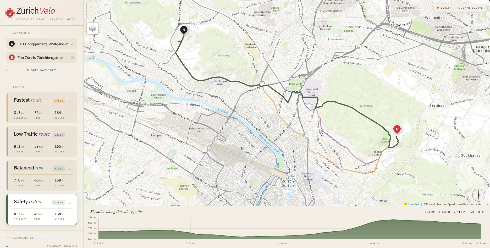

# ZürichVelo

A bicycle route planner for Switzerland. Enter two points, get up to five cycling strategies compared side-by-side with distance, time, elevation gain/loss, and an interactive elevation profile.



## Features

- **Five routing profiles** via BRouter — Fastest, Low Traffic, Balanced, Car-free, Safety
- **Duplicate-route deduplication** — profiles that produce the same GPS track are silently merged
- **Interactive elevation chart** — hover to pin a marker on the map; shows ascent ↑ and descent ↓
- **GPX export** — download any route as a standard GPX 1.1 file
- **Reverse geocoding** — clicking the map or dragging a pin resolves the nearest address via Nominatim
- **Resizable panels** — drag the sidebar edge or elevation chart top to resize
- **Switzerland-wide coverage** — search and click anywhere from Geneva to Graubünden
- **Tile failover** — automatically tries multiple tile providers; plug in a Thunderforest or MapTiler key for cycling-aware maps

## Getting started

```bash
pnpm install
pnpm dev       # http://localhost:5173
```

The app opens with a pre-loaded route (Zürich Bahnhofplatz → Affoltern am Albis) so you can explore immediately.

## Configuration

Open `src/constants.ts` and paste free API keys into `API_KEYS`:

```ts
export const API_KEYS = {
  thunderforest: '', // thunderforest.com — 150k tiles/mo, shows bike lanes
  maptiler:      '', // maptiler.com — 100k tiles/mo, great topo maps
};
```

Without keys the app falls back to free public tile servers (ESRI Topo, OSM, CARTO).

## Adding routing profiles

All five active profiles live in `PROFILES` in `src/constants.ts`. Add any BRouter profile key and the app will fetch, deduplicate, and display it automatically:

```ts
{ key: 'gravel', name: 'Gravel', emName: 'track', tag: 'gravel', color: '#a0522d', soft: 'rgba(160,82,45,0.12)' }
```

Other known BRouter profiles: `hiking`, `shortest`, `moped`, `mtb`, `gravel`, `electric`.

## Stack

- React 18 + Vite 5 + TypeScript 5 (strict)
- Tailwind CSS v4 with `@theme` design tokens
- Leaflet 1.9 (vanilla, imperative) for the map
- Chart.js 4 (vanilla canvas) for elevation profiles
- BRouter (brouter.de) for cycling route calculation
- Nominatim (OSM) for geocoding and reverse geocoding

## Scripts

```bash
pnpm dev       # development server with HMR
pnpm build     # TypeScript check + production build
pnpm preview   # serve the production build locally
```
